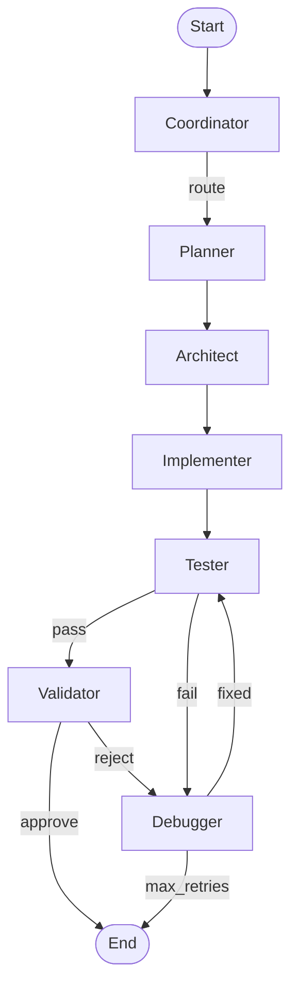

# Agent Swarm Architecture Guide

## Executive Summary

The Epic Agentic AI Coding Assistant is a multi-agent system designed to autonomously complete complex coding features with minimal human intervention. The system achieves significant cost reduction through intelligent model routing while maintaining the capability to work on 500-1000 line features autonomously.

**Core Design Philosophy:**
- **Local-First**: Prefer local Ollama models for routine tasks, escalate to cloud APIs only when necessary
- **Cost Optimization**: 60-80% cost reduction target through intelligent routing
- **Vertical Slice PRPs**: Each feature is implemented as a complete, working slice
- **Self-Healing**: Debugger loop allows automatic fixing of failures

---

## System Overview

### High-Level Architecture

```
┌─────────────────────────────────────────────────────────────────────────┐
│                           ENTRY POINT                                    │
│                     (example_real_task.py / run.py)                     │
└─────────────────────────────────┬───────────────────────────────────────┘
                                  │
                                  ▼
┌─────────────────────────────────────────────────────────────────────────┐
│                      WORKFLOW ORCHESTRATOR                               │
│  ┌──────────────────┐  ┌──────────────────┐  ┌──────────────────┐      │
│  │ WorkflowConfig   │  │ CheckpointManager│  │ State Management │      │
│  └──────────────────┘  └──────────────────┘  └──────────────────┘      │
└─────────────────────────────────┬───────────────────────────────────────┘
                                  │
                                  ▼
┌─────────────────────────────────────────────────────────────────────────┐
│                    LANGGRAPH WORKFLOW ENGINE                             │
│                                                                          │
│   ┌────────────┐    ┌─────────┐    ┌──────────┐    ┌────────────┐      │
│   │ COORDINATOR├───►│ PLANNER ├───►│ ARCHITECT├───►│IMPLEMENTER │      │
│   └────────────┘    └─────────┘    └──────────┘    └──────┬─────┘      │
│                                                           │             │
│                                    ┌──────────────────────┘             │
│                                    ▼                                    │
│   ┌──────────┐    ┌──────────┐    ┌─────────┐                          │
│   │ DEBUGGER │◄───┤ VALIDATOR│◄───┤ TESTER  │                          │
│   └────┬─────┘    └────┬─────┘    └─────────┘                          │
│        │               │                                                │
│        │   (retry)     │  (approve)                                    │
│        └───────────────┴──────────────► END                            │
└─────────────────────────────────────────────────────────────────────────┘
                                  │
                    ┌─────────────┼─────────────┐
                    ▼             ▼             ▼
┌─────────────────────┐ ┌─────────────────┐ ┌─────────────────────┐
│   LLM ORCHESTRATOR  │ │ TOOL ORCHESTRATOR│ │ MEMORY ORCHESTRATOR │
│  ┌───────────────┐  │ │ ┌─────────────┐ │ │ ┌───────────────┐   │
│  │ Model Router  │  │ │ │ Registry    │ │ │ │ Working Memory│   │
│  │ Fallback Chain│  │ │ │ Executor    │ │ │ │ Project Memory│   │
│  │ Response Cache│  │ │ │ Parallel    │ │ │ │ Global Memory │   │
│  └───────────────┘  │ │ └─────────────┘ │ │ └───────────────┘   │
└─────────────────────┘ └─────────────────┘ └─────────────────────┘
          │                     │                     │
          ▼                     ▼                     ▼
┌─────────────────────┐ ┌─────────────────┐ ┌─────────────────────┐
│   MODEL PROVIDERS   │ │  TOOL IMPLS     │ │  STORAGE BACKENDS   │
│ - Ollama (local)    │ │ - File System   │ │ - Redis (working)   │
│ - OpenAI            │ │ - Code Gen      │ │ - Qdrant (vectors)  │
│ - OpenRouter        │ │ - Git           │ │ - OpenAI Embeddings │
└─────────────────────┘ │ - Testing       │ └─────────────────────┘
                        │ - Validation    │
                        └─────────────────┘
```

---

## The 7-Agent Swarm

The system employs seven specialized agents, each with a distinct role in the workflow:

### 1. COORDINATOR (`src/agents/coordinator.py`)
**Purpose**: Orchestrates the overall workflow and routes tasks to appropriate agents.

**Responsibilities**:
- Analyzes incoming tasks
- Determines workflow routing based on status
- Monitors progress and handles high-level decisions
- Retrieves context from memory system

**When Active**: First in every workflow, and whenever routing decisions are needed.

**Key Behavior**:
```python
# Routes based on workflow status
routing_map = {
    PENDING: PLANNER,
    PLANNING: PLANNER,
    DESIGNING: ARCHITECT,
    IMPLEMENTING: IMPLEMENTER,
    TESTING: TESTER,
    VALIDATING: VALIDATOR,
    DEBUGGING: DEBUGGER,
}
```

---

### 2. PLANNER (`src/agents/planner.py`)
**Purpose**: Breaks down tasks into actionable subtasks and creates execution plans.

**Responsibilities**:
- Analyzes task requirements
- Creates hierarchical subtask breakdowns
- Estimates complexity for each subtask
- Retrieves relevant past plans from memory

**When Active**: After Coordinator routes to planning phase.

**Outputs**:
- List of subtasks with descriptions
- Estimated complexity per subtask
- Execution order/dependencies

**From the logs**:
```
2025-11-24 17:19:01,716 - Planner - Generated plan with 7 subtasks using LLM
```

---

### 3. ARCHITECT (`src/agents/architect.py`)
**Purpose**: Designs system architecture and component structure.

**Responsibilities**:
- Designs system architecture based on plan
- Identifies components and their interactions
- Specifies dependencies and interfaces
- Creates architecture documentation

**When Active**: After Planner completes, before Implementation.

**Outputs**:
- Architecture specification (components, dependencies)
- Technology decisions
- Interface contracts

---

### 4. IMPLEMENTER (`src/agents/implementer.py`)
**Purpose**: Generates actual code based on architecture.

**Responsibilities**:
- Translates architecture into code
- Uses code generation tools with LLM
- Writes files to the workspace
- Follows coding standards and best practices

**When Active**: After Architect completes the design.

**Key Tools Used**:
- `generate_code`: LLM-powered code generation
- `write_file`: Saves generated code to disk

**From the logs**:
```
2025-11-24 17:22:23,207 - Tool 'generate_code' executed: status=success, time=161478ms
2025-11-24 17:22:23,434 - Tool 'write_file' executed: status=success, time=226ms
```

---

### 5. TESTER (`src/agents/tester.py`)
**Purpose**: Generates and runs tests for the implementation.

**Responsibilities**:
- Generates unit tests using AST analysis
- Runs tests via pytest
- Reports test coverage and results
- Routes to Debugger if tests fail

**When Active**: After Implementer produces code.

**Key Components**:
- `TestingOrchestrator`: Coordinates test generation and execution
- `TestGenerator`: Creates tests based on code analysis
- `ASTParser`: Parses code structure for intelligent test generation

**From the logs** (second pass after debugger fix):
```
2025-11-24 17:24:59,616 - Generated 4 tests and 2 property tests
2025-11-24 17:25:00,235 - Pytest results: 4 passed, 0 failed
```

---

### 6. VALIDATOR (`src/agents/validator.py`)
**Purpose**: Final quality checks before completion.

**Responsibilities**:
- Validates implementation against requirements
- Checks code quality and standards
- Ensures all tests pass
- Approves or rejects for another iteration

**When Active**: After Tester reports all tests passing.

**Outputs**:
- Validation approval/rejection
- Quality metrics
- Completion status

---

### 7. DEBUGGER (`src/agents/debugger.py`)
**Purpose**: Fixes issues when tests fail or validation rejects.

**Responsibilities**:
- Analyzes test failures and errors
- Generates fixes using LLM
- Applies fixes to code
- Routes back to Tester for verification

**When Active**: When Tester reports failures or Validator rejects.

**Key Capability**: Self-healing loop - the system can automatically fix its own bugs!

**From the logs**:
```
2025-11-24 17:22:26,096 - Found 1 issues to debug
2025-11-24 17:24:58,478 - Successfully fixed src/calculator.py
```

---

## Workflow Engine (LangGraph)

### Core Files
- `src/core/workflow.py` - LangGraph workflow definition
- `src/core/nodes.py` - Node wrapper functions for each agent
- `src/core/edges.py` - Conditional routing logic
- `src/core/state.py` - State management utilities

### Workflow Compilation Pattern

**CRITICAL**: LangGraph requires checkpointer at compile time, not runtime:

```python
# CORRECT ✓
compiled = graph.compile(checkpointer=checkpointer)

# WRONG ✗
compiled = graph.compile()
compiled.invoke(state, checkpointer=checkpointer)  # Won't work!
```

### State Management

The workflow uses `AgentState` (TypedDict) to track:

```python
AgentState = {
    # Core workflow state
    "workflow_id": str,
    "project_id": str,
    "status": WorkflowStatus,
    
    # Agent communication
    "messages": List[Dict],
    "current_agent": str,
    "next_agent": Optional[str],
    
    # Task management
    "task": Dict,
    "subtasks": List,
    
    # Results
    "plan": Optional[Dict],
    "architecture": Optional[Dict],
    "implementation": Optional[Dict],
    "test_results": Optional[Dict],
    "validation_results": Optional[Dict],
    "debug_info": Optional[Dict],
    
    # Control flow
    "retry_count": int,
    "max_retries": int,
}
```

**CRITICAL**: State updates must be immutable - return new dict, never mutate!

### Edge Routing Logic

```python
# From tester - conditional based on test results
def route_from_tester(state):
    if state["test_results"]["all_passed"]:
        return "validator"  # Tests passed → validate
    else:
        return "debugger"   # Tests failed → debug and retry

# From debugger - retry loop
def route_from_debugger(state):
    if state["debug_info"]["fixed"] and state["retry_count"] < 3:
        return "tester"     # Fixed → retest
    else:
        return "end"        # Give up after max retries
```

---

## Service Architecture

### LLM Orchestrator (`src/services/llm_service.py`)

**Purpose**: Single entry point for all LLM operations with routing, caching, and fallback.

**Components**:

1. **Task Complexity Analyzer** (`src/llm/analyzer.py`)
   - Analyzes task descriptions
   - Determines complexity: SIMPLE, MEDIUM, COMPLEX
   - Estimates token counts
   - Identifies required capabilities

2. **Model Router** (`src/llm/router.py`)
   - Routes requests to appropriate models
   - Filters by capability, complexity, cost
   - Generates fallback chains
   - Caching key generation

   ```python
   # Routing strategy: cost_optimized (default)
   # Simple tasks → local Ollama (free)
   # Complex tasks → cloud APIs (paid)
   
   # Complexity-based routing
   SIMPLE: Any model, prefer local
   MEDIUM: Performance >= 0.6
   COMPLEX: Performance >= 0.8
   ```

3. **Fallback Chain Manager** (`src/llm/fallback.py`)
   - Manages provider failures gracefully
   - Automatic retry with exponential backoff
   - Falls back to alternative providers

4. **Response Cache** (`src/llm/cache.py`)
   - Semantic caching of LLM responses
   - Significant cost savings for repeated queries

**Available Models** (from logs):
```
- qwen2.5-coder:14b (Ollama - LOCAL, FREE)
- gpt-4o-mini (OpenAI - CLOUD)
- gpt-4o (OpenAI - CLOUD)
```

**From the logs** - routing in action:
```
Routing decision: qwen2.5-coder:14b (est. cost: $0.0000)
Generated response: qwen2.5-coder:14b (cost: $0.0000, latency: 109039ms, tokens: 396)
```

---

### Tool Orchestrator (`src/services/tool_service.py`)

**Purpose**: Manages all agent tools with retry logic and monitoring.

**Tool Categories**:

| Category | Tools | Description |
|----------|-------|-------------|
| `file_system` | `read_file`, `write_file`, `list_directory`, `create_directory`, `delete_file` | File operations |
| `code_generation` | `generate_code`, `refactor_code`, `add_tests` | LLM-powered code tools |
| `version_control` | `git_status`, `git_commit`, `git_diff` | Git operations |
| `testing` | `pytest`, `unittest` | Test execution |
| `validation` | `ruff`, `mypy`, `black` | Code quality tools |

**Tool Execution Pattern**:
```python
# In any agent:
result = await self.execute_tool(
    tool_name="generate_code",
    parameters={
        "description": "Calculator with add, subtract, multiply, divide",
        "language": "python",
        "context": "Include CLI interface",
    },
    workflow_id=state["workflow_id"],
)
```

**Code Generation Tool** (`src/tools/implementations/code_tools.py`):
- Builds detailed prompts for LLM
- Requests complete, production-ready code
- Strips markdown formatting from responses
- Falls back to templates if no LLM available

---

### Testing Orchestrator (`src/services/testing_service.py`)

**Purpose**: Coordinates test generation, execution, and analysis.

**Components**:

1. **AST Parser** (`src/analysis/ast_parser.py`)
   - Tree-sitter based multi-language parser
   - Supports: Python, JavaScript, TypeScript, Java, Go
   - Extracts functions, classes, dependencies

2. **Test Generator** (`src/testing/test_generator.py`)
   - Framework detection (pytest, unittest)
   - Intelligent test case generation
   - Property-based testing support
   - Coverage enhancement

3. **Framework Generators** (`src/testing/frameworks/`)
   - Pytest generator
   - Unittest generator

**Test Generation Flow**:
```
Source File → AST Parse → Extract Functions → Generate Tests → Save → Execute
```

**From the logs**:
```
Detected framework from test files: pytest
Extracted 4 testable functions from src/calculator.py
Generated 4 tests and 2 property tests
Saved tests to tests\test_calculator.py
Pytest results: 4 passed, 0 failed
```

---

### Memory Orchestrator (`src/services/memory_service.py`)

**Purpose**: Hierarchical memory system for context persistence.

**Three-Tier Architecture**:

| Tier | Storage | Purpose | TTL |
|------|---------|---------|-----|
| **Working** | Redis | Immediate context, fast access | 1 hour |
| **Project** | Qdrant (vectors) | Project-specific knowledge | None |
| **Global** | Qdrant (vectors) | Cross-project patterns | None |

**Capabilities**:
- Semantic search with embeddings
- Hybrid search (vector + keyword)
- RAG integration
- Checkpoint integration for long sessions

**From the logs**:
```
HTTP Request: POST http://localhost:6333/collections/project_memory/points/query
Stored memory 35acf4ae-c299-494b-975a-d4e79df63655 in project tier
Retrieved results from semantic cache
```

---

## The Calculator Task Walkthrough

Following the log file, here's exactly what happened when building the calculator:

### Phase 1: Setup (17:17:07 - 17:17:09)
```
Services initialized:
- LLM Service: 6 models available
- Tool Service: 16 tools registered
- Memory Service: Configured with Qdrant
- Checkpoint Manager: Ready
```

### Phase 2: Coordinator (17:17:09)
```
→ Created initial state
→ Saved initial checkpoint
→ Analyzed task, routed to Planner
```

### Phase 3: Planner (17:17:12 - 17:19:01)
```
→ Retrieved context from memory (semantic cache hit)
→ Called Ollama qwen2.5-coder:14b
→ Generated plan with 7 subtasks
→ Cost: $0.00 (local model)
→ Routed to Architect
```

### Phase 4: Architect (17:19:02 - 17:19:40)
```
→ Retrieved relevant memories
→ Designed architecture using LLM
→ Specified components and dependencies
→ Cost: $0.00
→ Routed to Implementer
```

### Phase 5: Implementer (17:19:40 - 17:22:24)
```
→ Used generate_code tool (161 seconds!)
→ LLM generated complete calculator code
→ Wrote to src/calculator.py
→ Cost: $0.00
→ Routed to Tester
```

### Phase 6: First Test Attempt (17:22:24 - 17:22:26)
```
❌ FAILURE: Syntax error in generated code (line 93)
→ 0 tests generated
→ Routed to Debugger
```

### Phase 7: Debugger (17:22:26 - 17:24:59)
```
→ Analyzed 1 issue
→ LLM generated fix (152 seconds)
→ Wrote fixed code to src/calculator.py
→ Cost: $0.00
→ Routed back to Tester
```

### Phase 8: Second Test Attempt (17:24:59 - 17:25:00)
```
✓ SUCCESS: Valid Python code
→ Extracted 4 testable functions
→ Generated 4 unit tests + 2 property tests
→ Saved to tests/test_calculator.py
→ Ran pytest: 4 passed, 0 failed
→ Routed to Validator
```

### Phase 9: Validation (17:25:00 - 17:25:02)
```
✓ APPROVED: All requirements met
→ Workflow complete!
```

### Final Stats
```
Total Duration: 472.80 seconds (~8 minutes)
Total Cost: $0.00 (entirely local LLM!)
Status: COMPLETE
```

---

## Key Scripts and Entry Points

### Main Entry Points

| Script | Purpose | Usage |
|--------|---------|-------|
| `example_real_task.py` | Full workflow demonstration | `python example_real_task.py` |
| `run.py` | Basic demo/verification | `python run.py` |

### Example Task Definition

```python
task = {
    "id": "build_calculator",
    "description": "Create a simple Python calculator with unit tests",
    "requirements": [
        "Implement basic arithmetic operations",
        "Add error handling for division by zero",
        "Write comprehensive unit tests with pytest",
        "Include a simple CLI interface",
        "Follow PEP 8 style guidelines",
    ],
    "constraints": [
        "Python 3.9+",
        "Use only standard library (except pytest)",
        "Keep it under 200 lines of code",
    ],
}
```

---

## Configuration

### Environment Variables (`.env`)

```bash
# LLM Providers
OPENAI_API_KEY=sk-...
OPENROUTER_API_KEY=sk-or-...

# Local Models (Ollama)
OLLAMA_BASE_URL=http://localhost:11434

# Storage Backends
REDIS_URL=redis://localhost:6379
QDRANT_URL=http://localhost:6333

# Memory Settings
MEMORY_TTL_WORKING=3600
MEMORY_CACHE_SIZE=1000
HYBRID_SEARCH_ALPHA=0.7

# Model Settings
EMBEDDING_MODEL=text-embedding-ada-002
```

### Workflow Configuration

```python
workflow_config = WorkflowConfig(
    project_id="calculator_project",
    enable_human_approval=False,  # Auto-approve
    max_retries=100,              # Allow many debug iterations
    save_artifacts=True,          # Save generated files
)
```

---

## PRP (Product Requirement Prompt) Methodology

The system was built using the Wirasm/PRPs-agentic-eng methodology:

### PRP Structure
Each feature is implemented as a focused, complete "vertical slice":
- **Goal**: Clear feature objective
- **Why**: Business justification
- **What**: Success criteria
- **Context**: All necessary information for implementation
- **Implementation Blueprint**: Detailed technical specs
- **Validation Loop**: 4 levels of testing

### Implemented PRPs (Phases 1-3)
1. **PRP-01**: Hierarchical Memory System ✓
2. **PRP-02**: Advanced State Management with LangGraph ✓
3. **PRP-03**: Dynamic Model Routing Engine ✓
4. **PRP-04**: Enhanced Tool Abstraction Layer ✓
5. **PRP-05**: AST-Based Code Analysis Engine ✓
6. **PRP-06**: Fractal Task Decomposition System ✓
7. **PRP-07**: Context-Aware RAG Implementation ✓
8. **PRP-08**: Planning & Architecture Agent Enhancement ✓
9. **PRP-09**: Multi-Framework Test Generation ✓
10. **PRP-10**: Browser Automation Integration ✓
11. **PRP-11**: Self-Healing Test System ✓
12. **PRP-12**: Coverage & Quality Gates ✓

### Upcoming PRPs
- PRP-13: Intelligent Caching System
- PRP-14: Budget Management & Tracking
- PRP-15: Parallel Execution Framework
- PRP-16: Performance Monitoring Suite
- PRP-17-20: Learning & Evolution phase

---

## Critical Patterns & Gotchas

### LangGraph Patterns

```python
# ✓ CORRECT: Checkpointer at compile time
graph.compile(checkpointer=checkpointer)

# ✓ CORRECT: TypedDict for state schema
class AgentState(TypedDict):
    workflow_id: str
    messages: List[Dict]
    ...

# ✓ CORRECT: Edge functions return strings
def route_from_tester(state) -> str:
    return "validator"  # Not validator_node!

# ✗ WRONG: Mutating state directly
state["messages"].append(msg)  # Don't do this!

# ✓ CORRECT: Return updates dict
return {"messages": state["messages"] + [msg]}
```

### Memory Key Naming Convention
```
{tier}:{agent_id}:{context_id}:{item_id}
# Example: project:implementer:calc_project:mem_12345
```

### Cost Optimization
- Always check if task can be handled by local model first
- Use semantic caching for repeated queries
- Batch vector operations when possible
- TTL on working memory prevents bloat

---

## Running the System

### Prerequisites
```bash
# Start storage backends
docker-compose -f docker/docker-compose.yml up -d

# Wait for services
sleep 5

# Verify services
redis-cli ping  # Should return PONG
curl http://localhost:6333/health  # Should return version info

# Install Ollama and pull model
ollama pull qwen2.5-coder:14b
```

### Execute a Task
```bash
# Configure API keys
cp .env.example .env
# Edit .env with your keys

# Run the demo
python example_real_task.py
```

### Monitor Progress
The system logs detailed progress:
```
Routing decision: qwen2.5-coder:14b (est. cost: $0.0000)
Tool 'generate_code' executed: status=success, time=161478ms
Generated plan with 7 subtasks using LLM
Pytest results: 4 passed, 0 failed
Workflow completed in 472.80s
```

---

## Architecture Diagram (Mermaid)



---

## Summary

The Agent Swarm system is a sophisticated multi-agent architecture that:

1. **Orchestrates** 7 specialized agents via LangGraph
2. **Routes** tasks to cost-optimal LLMs (local-first strategy)
3. **Generates** production-ready code using AI
4. **Tests** automatically with intelligent test generation
5. **Self-heals** through debugger feedback loops
6. **Remembers** context across sessions via hierarchical memory

The calculator task demonstrated the complete workflow in ~8 minutes at $0.00 cost, showcasing the system's ability to:
- Generate code autonomously
- Detect and fix its own bugs
- Produce passing tests
- Validate against requirements

This is a foundation for autonomous coding assistants that can handle complex, multi-file features with minimal human intervention.
